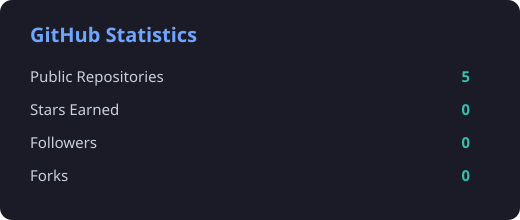
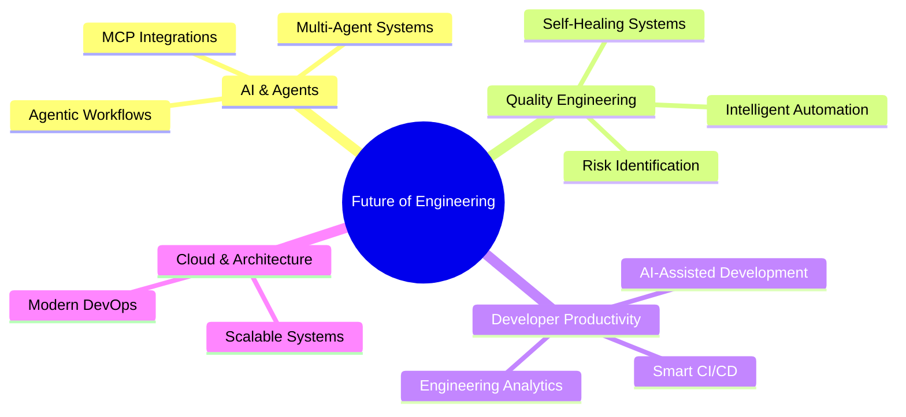

<!-- HERO SECTION -->

<div align="center">

# 👋 Hi, I'm Shrikant Mokal

### Senior Software Engineer • Quality Engineering • Automation • AI & Agentic Systems


<br/>

<a href="https://github.com/shrikish">
  
</a>

</div>

---

## 🧑‍💻 About Me

I'm a **Senior Software Engineer with 13+ years of experience** in **Quality Engineering, Test Automation, and Software Development**.

I specialise in designing scalable automation solutions and engineering workflows that help teams improve software quality, accelerate delivery, and reduce operational risk. Throughout my career, I have worked across **Retail, Banking, and Insurance**, combining strong technical foundations with a practical, business-focused mindset.

Today, I'm particularly interested in the intersection of **Quality Engineering, Artificial Intelligence, and Developer Productivity**.

* 🔭 Building and experimenting with **intelligent automation solutions**
* 🤖 Exploring **Agentic AI, AI-driven SDLC automation & multi-agent systems**
* 🧠 Interested in **GitHub Copilot, AI agents, MCP integrations & engineering intelligence**
* ⚙️ Passionate about improving **CI/CD pipelines and automation architecture**
* 🌱 Continuously learning about **AI, Cloud and the future of Software Engineering**
* 💡 I enjoy transforming complex engineering problems into simple, scalable solutions

---

## 🤖 From Test Automation to Intelligent Engineering

```text
Traditional Automation
        │
        ▼
Scalable Test Architecture
        │
        ▼
Intelligent CI/CD & Engineering Workflows
        │
        ▼
AI-Assisted Development
        │
        ▼
Agentic Engineering Systems 🚀
```

My current exploration focuses on how AI can help engineering teams **analyse, reason, recommend, and act**.

### Areas I'm exploring

🤖 **AI-Powered Quality Engineering**
🧠 **Agentic AI & Multi-Agent Collaboration**
🔗 **MCP & Tool Integration**
📊 **Intelligent Failure Analysis & Risk Identification**
⚡ **Developer Productivity & SDLC Automation**

---

## 🛠️ Tech Stack

### 💻 Languages & Development

<p>
  
</p>

### 🧪 Test Automation & Quality Engineering

<p>
  
  
  
  
  
  
</p>

### ⚙️ DevOps & Engineering Tooling

<p>
  
</p>

### 🤖 AI & Intelligent Systems

<p>
  
  
  
  
</p>

---

## 🚀 What I'm Working On

<table>
<tr>
<td width="50%" valign="top">

### 🤖 Intelligent QA Agents

Exploring agents that can:

* Analyse automation failures
* Investigate logs intelligently
* Generate and improve test cases
* Identify engineering risks
* Assist teams with faster decision-making

</td>
<td width="50%" valign="top">

### ⚙️ Smart Test Execution

Building smarter automation workflows that:

* Optimise test execution
* Use historical data for intelligent scheduling
* Improve CI/CD efficiency
* Reduce feedback time for developers
* Scale automation effectively

</td>
</tr>
<tr>
<td width="50%" valign="top">

### 🔗 Connected Engineering Systems

Experimenting with AI agents that connect:

* Jira
* Confluence
* Jenkins
* GitHub
* Splunk
* Automation frameworks

</td>
<td width="50%" valign="top">

### 📱 Software Development

Also exploring application development and modern platforms, including:

* Swift & SwiftUI
* iOS development
* Local data management
* AI-enhanced applications

</td>
</tr>
</table>

---

## 🧠 My Engineering Philosophy

> **"Automation is not about replacing people. It's about removing repetitive work so people can focus on solving better problems."**

I believe great engineering is a combination of:

```text
Strong Fundamentals
       +
Automation
       +
Continuous Improvement
       +
Intelligent Systems
       =
Engineering Excellence 🚀
```

---

## 📊 GitHub Analytics

## 📊 GitHub Analytics

<div align="center">





</div>


---

## 🌱 Currently Learning & Exploring



---

## 🎯 Core Expertise

| Area                   | Focus                                               |
| ---------------------- | --------------------------------------------------- |
| 🧪 Quality Engineering | Automation strategy, frameworks & scalable testing  |
| 💻 Test Automation     | Selenium, Playwright, Java, API testing             |
| 🔌 API Testing         | REST Assured, Postman & service integration         |
| ⚙️ DevOps              | Jenkins, Docker & CI/CD workflows                   |
| 🤖 AI Engineering      | AI-assisted development & Agentic systems           |
| 🏗️ Architecture       | Maintainable frameworks & engineering platforms     |
| 📈 Productivity        | Process improvement & intelligent workflows         |
| 🗣️ Leadership         | Technical strategy & business-focused communication |

---

## 💡 Beyond Code

I enjoy:

* 🚀 Exploring emerging technologies
* 🤖 Experimenting with AI and intelligent systems
* 🧩 Solving complex engineering challenges
* 👨‍🏫 Mentoring and knowledge sharing
* 📚 Learning new technologies and preparing for certifications
* 🏗️ Designing innovative engineering workflows

---

## 🐍 My Contributions

<div align="center">


</div>

---

<div align="center">

### ⭐ Motto

# *"Automate what is repetitive, simplify what is complex, and continuously learn what is next."*

---

**Thanks for visiting! Let's build the future of engineering. 🚀**


</div>
